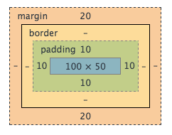
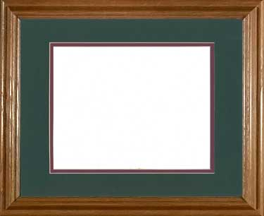
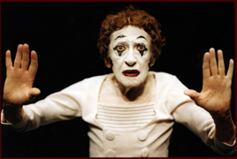

# Intro CSS

## Stylesheets - Where do styles live?

**The Best Way** - External (css lives in a separate file).

```
<html>
<head>
    <title>I like clean code</title>
    <link rel="stylesheet" href="css/styles.css">
</head>
<body>
    <p></p>
    <p></p>
</body>
</html>
```


```
p {
    font-size: 14px;
}
```

**The Lazy Way** - Internal

```
<html>
<head>
    <title>I feel lazy</title>
    <style type="text/css">
        p {
            font-size: 14px;
        }
    </style>
</head>
<body>
    <p></p>
    <p></p>
</body>
</html>
```

**The Worst Way** - Inline

Note: this is what chrome does when you add styles from the elements tab in your console. This is also how javascript applies css to elements.

```
<html>
<head>
    <title>I am a terrible person</title>
</head>
<body>
    <p style="font-size:14px;"></p>
    <p style="font-size:14px;"></p>
</body>
</html>
```

*Take away*

"Seperation of Concerns" is a best practice.

* HTML does Structure / CSS does Layout / JS does interaction
* Less code repetition
* Easier to read / organize / refactor

## Specificity - Which style wins?

Given the following html:

```
  <p class="pick-me" id="pick-me">What color am I?</p>
```

Which color wins? Round 1.

```
  p {
     color: red;
     color: green;
  }
  
  p {
     color: blue;
  }
```

Which color wins? Round 2.

```
  html body p {
     color: orange;
  }
  
  #pick-me {
     color: blue;
  }
  
  .pick-me {
     color: green;
  }
  
  p#pick-me.pick_me {
     color: red;
  }
  
  p.pick-me {
     color: yellow;
  }
```

Which color wins? Round 3.

```
  #pick-me {
     color: blue;
  }
  
  p#pick-me {
     color: orange;
  }
  
  p {
      color: red !important;
  }
```


Solutions:

1. blue beats green beats red.
1. red beats blue beats yellow beats green beats red beets oranges bananas.
1. red beats orange beats blue.


###The rules of CSS Specificity:

* Lower css rules / declarations overwrite higher ones.
* More *specific* selectors beat less specific ones
    * id > class > tag
        * no number of tags can beat a class
        * no number of classes can beat an id
* Inline styles > Internal styles > External styles 
* `!important` trumps all of the above.


## Inheritance - How can we reuse styles?


```
    <h1>Cheese Sale! <button>Buy Now!</button></h1>
    <p>We are selling cheese.</p>
    <div class="info-box">
        <h1>Sorry!</h1>
        <p>We're out of cheese.</p>
        <button>Complain</button>
    </div>
```

```
  h1 {
    color: blue;
  }
  
  .info-box {
    color: orange;
  }
  
  button {
    color: inherit;
  }
```

**Exercise**

What color is...

1. "Cheese Sale"?
1. "We are selling cheese"? 
1. "Sorry!"?
1. "We're out of cheese"?
1. "Buy Now"?
1. "Complain"?

When you've made your guesses, you can play with the code here:
[Inheritance Demo](http://codepen.io/pen/def?fork=WvvORV)

Which Properties are Inheritied? [See here.](http://www.w3.org/TR/CSS/#indices)

## Display: Inline vs. Block

`span` and `div` are our bread and butter. They are the HTML equivalent of hydrogen and oxygen.

|display:|inline|block|
|-------:|-----:|----:|
|   | `span` | `div` |


More inline elements:

* a
* small
* img
  
Block elements:

* h1, h2, h3
* p
* header, nav, footer, section, aside --> all just divs by another name!

You can think of these tags as...

```
small = span + special_sauce
h1 = div + special_sauce
```

**Exercise**

Build your own:

* Make an inline element with a class of "strike" that "strikes out" the font inside of it.
* Make an inline element with a class of "keyword" that puts a thin black box around text.
* Make a block element with a class of "danger" with red font, a yellow background, and generous padding.
* Make a block element with a class of "success" with green font, and a thin gray border.


## Box Model: Everything is a box!

From outside, in:

* margin
* border
* padding
* content



**Like a picture frame:**

* The painting is the content.
* The "matte board" is the padding (which allows the content to breathe).
* The frame is the border.
* And margin? Margin is the distance between one painting and the next.



**Content**

Content can be text, other elments, or nothing at all. The dimensions of your box depends on what you put in it, and whether or not you explicity set a `height` and `width`.





## CSS Shorthands

These are equivalent:

```
p {
    padding: 2em;
    /*padding-top: 2em;*/
    /*padding-right: 2em;*/
    /*padding-bottom: 2em;/*/
    /*padding-left: 2em;*/
         
    border: 2px solid black;
    /*border-width: 2px;*/
    /*border-style: solid;*/
    /*border-color: black;*/
}
```


##Resources

* CSS Reference - https://developer.mozilla.org/en-US/docs/Web/CSS/Reference
* CSS Properties List - https://css-tricks.com/almanac/properties/
* What are the Default CSS Values? - http://www.w3.org/TR/CSS2/sample.html
* Which Properties can be Inherited? - http://www.w3.org/TR/CSS/#indices