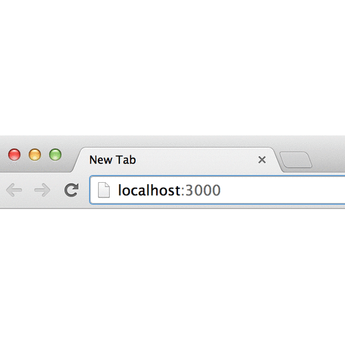

# Intro Express
## Routes, Params, and Queries

| Objectives |
| :---- |
| Review and discuss the request and response cycle |
| Describe the parts of an HTTP request and url  |
| Apply basic routing knowledge to build a simple application |


## Outline

* Intro Express
	* A Simple App
* Routing
	* HTTP GET  
	* Request Params
* Query Params

### Getting Started

Before we get started let's setup a project directory.

```
mkdir express_examples
cd express_examples/
```

## Intro Express

**Background**

* What is Node.js?
	* A tool to run JavaScript outside the browser and directly on your OS.
* What is a *web application framework*?
	* A tool for handling middleware integration, routing, and other relevant concerns.
* What is Express?
	* A relatively small web application for building applications in Node.js.

### Setting Up	

Let's start up a simple **Express** application before we go forward:

* Make a directory and `index.js`  
	
	```
	mkdir quick_example
	cd quick_example/
	touch index.js
	```

* Then create a `package.json`, use the method below or substitute it with `npm init`.

	```
	echo {} > package.json
	npm install --save express
	subl .
	```
	
* 


Now we need write some code for our simple application.


`index.js`

```
var express = require('express'),
	app = express();
	
app.get("/", function (req, res) {
	res.send("Hello World");
});

app.listen(3000, function () {
	console.log("Go to localhost:3000/");
});

```

Now you can start the web application: 

```
node index.js
```


### Viewing Our Server 

Go to `localhost:3000`

* This sends a request like the following to the server
	
	```
	GET / HTTP/1.1
	Host: localhost:3000
	Connection: keep-alive
	Cache-Control: max-age=0
	Accept: text/html,application/xhtml+xml,application/xml;q=0.9,image/webp,*/*;q=0.8
	User-Agent: Mozilla/5.0 (Macintosh; Intel Mac OS X 10_9_5) AppleWebKit/537.36 (KHTML, like Gecko) Chrome/42.0.2311.135 Safari/537.36
	Accept-Encoding: gzip, deflate, sdch
	Accept-Language: en-US,en;q=0.8
	If-None-Match: W/"b-4a17b156"
	```

* The Server sends back something like the following:
	
	```
	HTTP/1.1 200 OK
	X-Powered-By: Express
	ETag: W/"b-4a17b156"
	Date: Mon, 11 May 2015 00:20:24 GMT
	Connection: keep-alive
	
	Hello World
	```




## Routing

Building an application will require us to have a firm grasp of something we call **routing**.  Each **route** is a combination of a **Request Type** and **Path**.

| Request Type | Request Path | Response
| :--- | :--- | :--- |
| `GET` | `/` | `Hello World` |
| `GET` | `/burgers` | `Hamburger`, `Cheese Burger`, `Dble Cheese Burger` | 
| `GET` | `/tacos` | `Soft Taco`, `Crunchy Taco`, `Super Taco` |


Let's build these into our application:

`index.js`

```
var express = require('express'),
	app = express();
	
var burgers = [
				"Hamburger",
				"Cheese Burger",
				"Dble Cheese Burger"
			   ];
			   
var tacos = [
				"Soft Taco",
				"Crunchy Taco",
				"Super Taco"
			   ];
	
app.get("/", function (req, res) {
	res.send("Hello World");
});

app.get("/burgers", function (req, res) {
				   
	res.send(burgers.join(", "));
});

app.get("/tacos", function (req, res) {
				   
	res.send(tacos.join(", "));
});

app.listen(3000, function () {
	console.log("Go to localhost:3000/");
});

```

### Route Params

Typically you will want to interact with a `resource` on a server, but in order to do that you'll have to have specify an `id` of some sort.


```
GET `/tacos` => `Soft Taco, Crunchy Taco, Super Taco`
```

But that route doesn't really respond to the input we've specified. Fortunately, there is a way to make a route more dynamic. Let's add the following route:

```
app.get("/greet/:name", function (req, res) {
	res.send( "Hello, " + req.params.name );
});
```

Here we are seeing the first introduction to parameters that the application can identify. In the following route `:name` is consider a route parameter. We can access it using `req.params.name`.

| Request Type | Request Path | Response
| :--- | :--- | :--- |
| `GET` | `/greet/:name` | `Hello, :name` |


### Exercise

* Write a route with to allow you to access a `taco` by it's index in the array.
* Write a route with to allow you to access a `burger` by it's index in the array.

------

The above routes require a little bit of engineering. We don't want to loose our nice route `/tacos` or `/burgers` that give us a list of burgers. However, we do need to indicate we want either a burger or taco.

```
app.get("/burgers/:index", function (req, res) {
	var index = req.params.index;
	var burger = burgers[index];
	res.send(burger)
});

```

Similarly, you do the same for a `taco`.

### Query Params

Generally, you don't want to cram everything into a route. Just imagine when there can be multiple parameters in route. Or, consider what kind of experience you'd be creating for people if the go the order of parameters wrong. Luckily, there are query parameters you can send with each request to a server that can be used to send back a response.


Let's see query params in action. Go to [https://google.com/search?q=kittens&tbm=isch](https://google.com/search?q=kittens&tbm=isch)


Let's add our first route to practice query params.

```
app.get("/thank", function (req, res) {
	var name = req.query.name;
	res.send("Thank you, " + name);
});
```

Go to [localhost:3000/thank?name=jane](localhost:3000/thank?name=jane). Note how we are now listing our parameters in the url after a `?`.

Let's continue our exploration of query parameters.

## Calculator Exercise

* Build a `/multiply` route that uses query params `x` and `y` to multiply numbers and send the result back.
* Build a `/add` route that uses query params `x` and `y` to add two numbers and send the result back.

----

### Discussion

For our `/multiply` route we can try something like the following:

```
app.get("/multiply", function (req, res) {
	var x = req.query.x;
	var y = req.query.y;
	var result = x * y;
	res.send(x + " plus " + y + " is " + result);
});
```

Hmm, that seems like it might work. Let's try that with our `/add` route.

```
app.get("/add", function (req, res) {
	var x = req.query.x;
	var y = req.query.y;
	var result = x + y;
	res.send(x + " plus " + y + " is " + result);
});
```

Hmm, why doesn't the above work? Well, all parameters are strings so when we add them we are treating them as strings. We want to turn them into numbers first. You should use `parseInt` to convert the numbers to integers.

```
app.get("/add", function (req, res) {
	var x = parseInt(req.query.x, 10);
	var y = parseInt(req.query.y, 10);
	var result = x + y;
	res.send(x + " plus " + y + " is " + result);
});
```

Note we said `parseInt` with `10` passed in as an argument because the we want integers in `base10`. You should refactor the `/multiply` route to also use `parseInt`.

## Summary

We learned about 

* Routing to different resources, i.e. `/burgers` and `/tacos`.
* Using information in our route, i.e. `/burgers/:index` and `/tacos/:index`.
* Using query paramters to form responses: `/thanks`, `/add`, and `/multiply`.

This will be critical for building applications with multiple resources and interacting with them: `/users`, `/articles`, `/comments`, et cetera.


## Middleware, Static Files, and Assets

| Objectives |
| :---- |
| Review and discuss routing parameters |
| Explain and apply basic middleware for express |
| Apply static file serving for views and assets |


### Outline

* Review routing params
* Introduce views
	* Sendfile
* Using forms
* Handling form posts


### Setting Up

```
mkdir burger_app/
cd burger_app
touch index.js
npm init
npm install --save express 
```

### Routing Params


Let's build a `burgers` application. Let's start by creating a root route.


```
var express = require("express"),
	app = express();


// the root route
app.get("/", function (req, res) {
	var text = "View all burgers at " +
				"<a href='/burgers'>/burgers</a>";
	res.send(text);
});

app.listen(3000, function () {
	console.log("GO TO localhost:3000");
});

```


When you click the link after starting the server you should get an error. Now, let's add a route to view all burgers.


```
var express = require("express"),
	app = express();

var burgers = [
				"Hamburger",
				"Cheese Burger",
				"Dble Cheese Burger"
			   ];

// the root route
app.get("/", function (req, res) {
	var text = "View all burgers at " +
				"<a href='/burgers'>/burgers</a>";
	res.send(text);
});

app.get("/burgers", function (req, res) {
	var burgersText = burgers.join(", ");
	res.send(burgersText);
});

app.listen(3000, function () {
	console.log("GO TO localhost:3000");
});

```

It is terrible that we are not sending properly formatted HTML responses, and we should build those up, but let's ignore that for now. We don't want to clutter our application right now with string concatentations.

### Sending A File

However, if there is a pretty stand HTML file you want to send as a response. There are ways to send files using Express.


Let's first create the file we want to send.

```
mkdir views
touch views/contact.html
```

Then let's put some contact info in our `contact.html`.

`views/contact.html`

```
<!DOCTYPE html>
<html>
	<head>
		<title>CONTACT</title>
	</head>
	<body>
	1234567
	</body>
</html>

```

In order to send this file we will need to use `res.sendFile`, which is a utility built into Express to help us send files. Next, we want to be able to specify, which file we want to send, `./views/contact.html`. In order to build up the `path` to this file we are going to use a built in Node utility called `path`.

> **path** is  just a utility built into node to help us **correctly** concat file paths
> 
> ```
> var path = require("path");
>
> path.join("Documents/", "/Homework");
> // => "Documents/Homework"
>
 ```


Let's add the following lines to our application somewhere near the top. Then let's make a `views` variable to hold a string that references the `./views` directory. *Note that the `./` means **current working directory***.
 
```
var path = require("path");
// define the ./views directory as a variable
var views = path.join(process.cwd(), "views");


```


Then let's add a route to handle grabbing the `contact.html` file from the `./views` directory.

```
...

app.get("/contact", function (req, res) {
	// helps go to ./views/contact.html
	var contactPath = path.join(views, "contact.html");
	res.sendFile(contactPath);
});
```


In total we should have the following:

```
var express = require("express"),
	app = express();

var path = require("path");
// define the ./views directory as a variable
var views = path.join(process.cwd(), "views");


var burgers = [
				"Hamburger",
				"Cheese Burger",
				"Dble Cheese Burger"
			   ];

// the root route
app.get("/", function (req, res) {
	var text = "View all burgers at " +
				"<a href='/burgers'>/burgers</a>";
	res.send(text);
});

app.get("/burgers", function (req, res) {
	var burgersText = burgers.join(", ");
	res.send(burgersText);
});

app.get("/contact", function (req, res) {
	// helps grab ./views/contact.html
	var contactPath = path.join(views, "contact.html");
	console.log(contactPath)
	res.sendFile(contactPath);
});

app.listen(3000, function () {
	console.log("GO TO localhost:3000");
});
```


### Exercise 

* Add a `home.html` file to your `views` folder and put some content inside it. Send it as a response when users go to [localhost:3000](localhost:3000/).

----

Let's make a `form` on our page to help us submit `burger` data to the server. Make a form that looks like the following on our `home.html`.

`/views/home.html`

```
<form action="/burgers" method="POST">
	<button>SEND REQUEST</button>
</form>

```

If we click this button we should get an error because we don't have a route to handle a `post` to `/burgers`.

```
app.post("/burgers", function (req, res) {
	res.send("BURGER POST RECEIVED!");
});
```

Now when we click our button we should see `"BURGER POST RECEIVED!"`. Now we aren't actually creating anything yet. To create something we'll need to actually add inputs fields into our `form`.

```
<form action="/burgers" method="POST">
	<input type="text" name="burger[name]" placeholder="what's your burger?">
	<button>SEND REQUEST</button>
</form>
```

When we submit this form we'll want to access the data being sent. There is only one problem... **data sent in the form is not a url or route param** so we can't access it using **req.query** or **req.params**. In fact, our app can't even process form data without a library to help us.


----

### Middleware


Let's install our first middleware. It's called `body-parser` and it will parse the body of a request being sent to us by the browser when a form is submitted.


```
npm install --save body-parser
```

Now we need to integrate it into the application. 

```
...
var bodyParser = require("body-parser");

app.use(bodyParser.urlencoded({extended: true}));

```

The `app.use` statement is telling our application to literally use the `body-parser` library before it moves onto route the request.

Now that we have the above setup we can update our `app.post("/burgers", ...)` route to use the `body` params submitted by the form.

```
app.post("/burgers", function (req, res) {
	var burger = req.body.burger;
	res.send("Nice " + burger.name);
});
```


All together we should have something like the following:


```
var express = require("express"),
	app = express();


var path = require("path");
// define the ./views directory as a variable
var views = path.join(process.cwd(), "views");

var bodyParser = require("body-parser");

app.use(bodyParser.urlencoded({extended: true}));

var burgers = [
				"Hamburger",
				"Cheese Burger",
				"Dble Cheese Burger"
			   ];

// the root route
app.get("/", function (req, res) {
	var text = "View all burgers at " +
				"<a href='/burgers'>/burgers</a>";
	res.send(text);
});

app.get("/burgers", function (req, res) {
	var burgersText = burgers.join(", ");
	res.send(burgersText);
});

app.get("/contact", function (req, res) {
	// helps grab ./views/contact.html
	var contactPath = path.join(views, "contact.html");
	console.log(contactPath)
	res.sendFile(contactPath);
});

app.get("/home", function (req, res) {
	var homePath = path.join(views, "home.html");
	res.sendFile(homePath);
});

app.post("/burgers", function (req, res) {
	var burger = req.body.burger;
	res.send("Nice " + burger.name);
});

app.listen(3000, function () {
	console.log("GO TO localhost:3000");
});
```

-----

### Adding Burgers

Instead of just responding with `Nice ...` let's actually add a burger to our list of burgers.

```
app.post("/burgers", function (req, res) {
	var burger = req.body.burger;
	burgers.push(burger);
	res.send("Nice " + burger.name);
});

``` 

That's pretty good! We can also send back a url where they can view their new burger.


```
app.post("/burgers", function (req, res) {
	var burger = req.body.burger;
	burgers.push(burger);
	res.send("See all burgers at localhost:3000/burgers");
});

```

Even better we could use something called a `redirect` to just send their browser there.

```
app.post("/burgers", function (req, res) {
	var burger = req.body.burger;
	burgers.push(burger);
	res.redirect("/burgers");
});
```

### Adding Assets

With our Express application we want to be able to serve assets **javascripts**, **stylesheets**, and **images**. By convention we generally put all these into a `public/` directory in our project.

```
app.use(express.static("public"))
```

Now we can make subfolders in our `public` folder for our assets.


```
mkdir public/javascripts
mkdir public/stylesheets
mkdir public/images

touch public/stylesheets/app.css
```


Inside of our `app.css` we can add some style for the body of our app.

```
body {
	background-color: red;
	color: white;
}
```


Then we just add `link` tag in our `home.html` or other `view` files.


```
<!DOCTYPE html>
<html>
	<head>
		<title>HOME</title>
	</head>
	<body>
	<form action="/burgers" method="POST">
		<input type="text" name="burger[name]" placeholder="what's your burger?">
		<button>SEND REQUEST</button>
	</form>
	</body>
</html>

```

