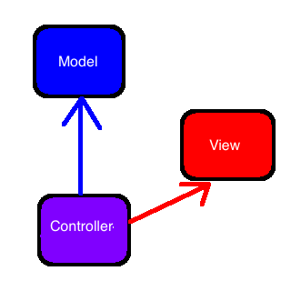

# Intro to Rails
## A Routing First Overview

|	Objective	|
|	:----		|
|	Student should be able to properly route a request for a resource |
| 	Student should be able to setup CRUD routing for a resource |
| 	Student should be able to explain the high level connection between the MVC pattern and RESTful routing for resources |

> Using Ruby 2.2.1, and Rails 4.2.1

| Note |
| :--- |
| This is a first introduction and high level overview of Rails. **No one should expect to fully understand all the topics covered**. We will discuss each topic more in specialized lessons following this lesson. Then we will review in more comprehensive lessons. |

## Past Feedback

| Graham Wong (WDI SF Jan-March 2014) via Hipchat|
| :-- |
| *I think [R]ails is one of those things that just makes sense once you start doing it*  |

## Moving Away from Our First Framework

What do we want you to take away from your experience with Express?

* Routing a request
* Handling `params` in a request
* Templating a view with `ejs`
* Persisting Data
* Code Organization

If you are familiar with those then you are prepared and will practice them again in Rails. Try not to worry about data or databases when reviewing these notes.

## Why The Rails Workflow and Organization (Bullet)?

In a bullet list, the why is as follows:
	
* to separate certain aspects found in larger applications  

* to familiarize ourselves with the most common pattern used to design web applications, **Model-View-Controller**  

* to facilitate workflow using conventions 
	 
	*not re-inventing the wheel every time*

## Need More Explanation About Code Organization? 

### Separating Concerns

In writing a large application it is important to establish something known as **Separation of Concerns**, *writing modular code that focuses on one aspect within the application.* The benefit of this is similar to the idea of **compartementalization** with respect to a production line, which allows for *more rapid development* by being able to **divide and conquer** the construction of a product. Comparments can focus on one task and optmize functional concerns far outside the scope of other compartments, but still achieve the expected component.  Ultimately it reduces the headache of debugging and controlling a large application that will ultimately grow to a level of complexity that no one person could ever fully comprehend (nor want or need to). 

### Organizational Principles

In order to manage the development of emerging aspects within a project it is important to construct a guideline that will shape how things are separated, a **design pattern**, which everyone can use to maintain **consistent** organization of application components. This often involves a *conventional* choice that helps to understandably scale a project. Part of the role of a developer is to become familiar with using design patterns, but this takes time (and trust), and different patterns emphaize an array of qualities: scalability, modularity, interoperability, security, performance, et cetera.

### Conventions To Focus On

In Rails we see one of the most popular patterns of Web Application Design that has evolved over the years, **Model-View-Controller**. The **MVC** patterns seeks to separate components into **Data Concerns**, **Presentation Concerns**, **Request and Response (or Action) Concerns** respectiveley:

**MVC**

| Component | Type of Concern |
| :--- | :--- |
| **M**odel | Data Concerns |
| **V**iew | Presentation Concerns |
| **C**ontrollers  | Request and Response (or Action) Concerns |

Having a **Model** component helps avoid issues of mixing the logic of gathering or editing data with displaying it (*Views*) or determining what data is related to requests from app users (*Controllers*).

Having a **View** dedicates one component just to specializing presentation of html to users using data without worrying about how data was retrieved (*Model*) or if it was relevant to a request made by a user (*Controller*).

Having a **Controller** component helps manage which data resources are relevant to a request from a user, what to do with the data, and how to respond to a user without worrying about how to present an html response (*View*) or manage logic concerning data(*Model*).
### Short Story

### Related Materials/Information

* Conventions over Configurations 
* Models, Views, and Controllers 
* HTTP (**GET, POST, PUT, Delete**) verbs
* The `params` of a request, (Covered in **Express**)
* Forms (**action**, **method**, and **form fields**)
* redirects

## Lesson Road Map

We demonstrate routing by making an application to handle managing our favorite planes.

* Talk CRUD and RESTful routing conventions
* Create a new **app folder** for our routing app
	* Setup an index
		* write an **index route** for planes
		* make a **controller** for planes
			* make an **index method**
		* make an **index view**
		* generate a **plane model**
	* Setup a new
		* make a **new route** that presents a form for new planes
		* make a **new method** in the **PlanesController**
		* make a **new view**
	* Setup a create
		* make a **create route** for submitting new planes
		* make a **create method** for saving new planes and redirecting
		

## CRUD and REST

**CRUD** stands for **Create**, **Read**, **Update**, **Delete**. These are the minimum and most common actions need for interacting with data in an application. For example someone needs to be able to *Create* their facebook profile, **Read** it, **Update** it, and if they're busy, **Delete** it.

Typically we associate **CRUD** with the following **HTTP** methods

| CRUD Operation | HTTP Method | Example|
| :---  |	:--- | :-- |
| Create | POST | `POST "/puppies?name=spot"` (create a puppy named spot) |
| Read   | GET  | `GET "/puppies"` (Shows all puppies) |
| Update | PUT or UPDATE | `PUT "/puppies/1?name=lassy"` (change puppy number 1 to have name lassy) |
| Delete | DELETE | `Delete "/puppies/1"` (destroy the first puppy, yikes!!!!) |

REST stands for **REpresentational State Transfer**. We will demonstrate these practices throughout this lesson, but for now preparing don't worry too much about it yet.

## Part 1: On the Runway 

### Setup With Rails New

| Motive:  |
|:----|
| Familiarize ourselves with the initial setup of a new application with the intent of making a *planes* application |

* `$ rails new route_app`
* `$ cd route_app`
* `$ rails s`

Now our app is up and running, [localhost:3000](localhost:3000/). At our `root`route we notice a "Welcome aboard message". That's because we have yet to create a **controller** and **views** that we can set as our **root**.

### A Look at Routes

In *Rails*, routing information for incoming requests are separated out into their own file, under `config/routes.rb`, that defines how to connect *requests* to *controllers*. Go to `config/routes.rb` and inside the routes block erase all the commented text. It should now look exactly as follows

	Rails.application.routes.draw do

	end

 Now we can define all our routes.

> NOTE: A **Controller** is a class that just handles rendering views and managing data resources using methods you'll define. 

Your `routes.rb` will just be telling your app how to connect *HTTP* requests to a **Controller**. Let's get ready for our first route. 

* The nature of any route goes as follows:
	
		request_type '/for/some/path/goes', to: "controller#method"

	e.g. if we had a `PuppiesController` that had a `index` method we could say

		get "/puppies", to: "puppies#index"

* Using the above routing pattern we'll write our first 

	`/config/routes.rb`

		Rails.application.routes.draw do
			get '/', to: "planes#index"
		end
		
	We'll have to define a `planes` controller and a `index` method soon enough.
	
* However, we distinguish the `'/'` (*root*) from other routes, and we just write `root to: 'planes#show'` to indicate it in `routes.rb`.

	`/config/routes.rb`

		Rails.application.routes.draw do
			root to: 'planes#index'
		end

### Making a Planes Controller

We want to create a *planes_controller*. **NOTE**: Controller names are always plural and files should always be `snake_case`.

	$ subl app/controllers/planes_controller.rb

Let's begin with the following 

	class PlanesController < ApplicationController
		def index
			render text: "Hello, pilots."
		end
	end

We have defined the`PlanesController` *class*, given it the method `#index`, and told the `#index` to render a *text* response `'Hello, pilots.'`

> Note:  We've also indicated that `PlanesController` inherits from `ApplicationController`, which looks like the following:

>		class ApplicationController < ActionController::Base
	 	 # Prevent CSRF attacks by raising an exception.
	 	 # For APIs, you may want to use :null_session instead.
	 	 protect_from_forgery with: :exception
		end

> Indeed, `ApplicationController` also inherits from `ActionController::Base`, which is just the main *action* handling class. Actions it might handle are requests, responses, rendering views, etc. The `ApplicationController` helps define the setup/configuration of all other controllers and has methods defined accross the entire application.

If we go to [localhost:3000/](localhost:3000/) we get the greeting.

### A View For Planes

Let's seperate our rendered greeting into a view called `index.html.erb`, which by default `ActionController` will look for in a  `app/views/planes/` folder. Create the `app/views/planes` folder and the file below

`app/views/planes/index.html.erb`

	Hello, pilots!

and make the following changes to `PlanesController`.

`app/controllers/planes_controller.rb`

	PlanesController < ApplicationController
		
		def index
			# Note it used to say 
			#	render text: 'Hello, pilots'
			render :index
		end
		
	end

### A Model Plane (an automagical first use)

A model is just a representation of a SQL table in our database, and the communication between the two is handled by rails via `ActiveRecord`, which has a list of prestored SQL commands to facilitate communication.

In terminal, we create our plane model using a rails generator as follows,

	$ rails g model plane name:string design:string description:text
	
which just creates the instructions in our app to tell SQL to create our model. To actually create this table data in our SQL database we do a migration. To migrate our database we use `rake` as follows:

	$ rake db:migrate
	
Now our application will have access to a model called `Plane` that will be persitent. Don't worry too much about the `rake` command that was just used as previous students have had the same frustration with it.

| Jerome Allouche WDI SF (JAN-MARCH) HipChat|
| :--- |
| "[T]ook me a while to understand what "rake" is conceptually \ ... \ maybe include a resource like this? \ [suggestion](https://gist.github.com/DelmerGA/8ad9f9f5b075c51df858) " |

### Making your first Model

**NOTE: DON'T SKIP THIS STEP**

We go straight into terminal to enter *rails console*.

	$ rails console
The command above enters the rails console to play with your application. 

To create our first plane model in our database we use our reference the `Plane` class and call the `Plane#create` method to write our plane to our database.

	> Plane.create({name: "x-wing", design: "unknown", description: "top secret"}) 
	=> #<Plane ....>

This will avoid issues later with `index` trying to render planes that aren't there.

## Back to Routes

|	Motive	|
|	:----	|
|	We've seen a little of each part of the MVC framework, and now we cycle back through over and over as we develop an understanding of the work flow.

	

### A new route for planes

We don't have any planes in our database yet. To be able to make planes we must create a route for them. The *RESTful* convention would be to make a form available at `/planes/new`. 

Let's add this route.

`/config/routes.rb`

	RouteApp::Application.routes.draw do
		root to: 'planes#index'
		
		# just to be RESTful
		get '/planes', to: 'planes#index'
		
		# it's a `get` because 
		#	someone is requesting
		# 	a page with a form
		get '/planes/new', to: 'planes#new'
		
	end

### A new method for planes

The request for `/planes/new` will search for a `planes#new`, so we must create a method to handle this request. This will render the `new.html.erb` in the `app/views/planes` folder.

`app/controllers/planes_controller.rb`

	PlanesController < ApplicationController
		
		...
		
		def new
			render :new
		end
		
	end

### A new view for planes

Let's create the `app/views/planes/new.html.erb` with a form that the user can use to sumbit new planes to the application. Note: the action is `/planes` because it's the collection we are submiting to, and the method is `post` because we want to create.

`app/views/planes/new.html.erb`

	<form action="/planes" method="post">
		<input type="text" name="plane[name]">
		<input type="text" name="plane[design]">
		<textarea name="plane[description]"></textarea>
		
		<button> Save Plane </button>
	</form>

Note: how we have now defined our next `route`, which is 
	
	post "/planes", to: "planes#create"
	

### Creating another route

Our submission of the `plane` form in `new.html.erb` isn't being routed at the moment let's change that

`/config/routes.rb`

	RouteApp::Application.routes.draw do
		root to: 'planes#index'
		
		get '/planes', to: 'planes#index'
		
		get '/planes/new', to: 'planes#new'
		
		# handle the submitted form
		post '/planes', to: 'planes#create'
		
	end

### Creating another method

This leads to the most complicated method yet to be talked about. For now we will just make it redirect to the `"/planes"` route.

`app/controllers/planes_controller.rb`

	PlanesController < ApplicationController
		
		...
		
		def create
			redirect_to "/planes"
		end
		
	end

> Someone should now be able to submit a form to our site, right???

### A fatal flaw

It turns out that forms aren't so simple in Rails anymore. There are security concerns that rails is trying to handle from the very beginning. 

> Recall that we indicated that `PlanesController` inherits from `ApplicationController`, which looks like the following:

>		class ApplicationController < ActionController::Base
	 	 # Prevent CSRF attacks by raising an exception.
	 	 # For APIs, you may want to use :null_session instead.
	 	 protect_from_forgery with: :exception
		end
> The line that says
> 
> 		protect_from_forgery with: :exception
> means that our forms will have added layer of security. 

To even get our rails app to accept our form it needs an `authenticity_token`, which we will casually add in and explain later.

`app/views/planes/new.html.erb`

	<form action="/planes" method="post">
		<input type="text" name="plane[name]">
		<input type="text" name="plane[design]">
		<textarea name="plane[description]"></textarea>
		<%= token_tag form_authenticity_token %>
		
		<button> Save Plane </button>
	</form>

Our form should now submit properly. However, we will see that rails makes handling all the things required in a form easier using something called *form helpers* later.

### An operational create method

We just need to save the data being sent in the request. We might be tempted to do the following.

`app/controllers/planes_controller.rb`

	PlanesController < ApplicationController
		
		...
		
		def create
			plane = params[:plane]
			Plane.create(plane)
			redirect_to "/planes"
		end
		
	end

However, while this might be fine in rails `3.2` it won't fly in rails `4.0`, which has something called **strong parameters**. To follow this strong parameters convention we must change the way we accept params to something like one of the following.

We can grab the `:plane` hash out of the `params` hash, and the tell it to permit the keys we want: `:name`, `:design`, and `:description`.

`app/controllers/planes_controller.rb`

	PlanesController < ApplicationController
		
		...
		
		def create
			plane = params[:plane].permit(:name, :design, :description)
			Plane.create(plane)
			redirect_to "/planes"
		end
		
	end

or, (preferably) just say `.require(:plane)`

`app/controllers/planes_controller.rb`

	PlanesController < ApplicationController
		
		...
		
		def create
			plane = params.require(:plane).permit(:name, :design, :description)
			Plane.create(plane)
			redirect_to "/planes"
		end
		
	end

In reality **strong params** is just a nice way of making sure someone isn't setting param values that you don't want them to be setting.

### Refactoring our Index

We first need to setup our `#index` method in `planes`

`app/controllers/planes_controller.rb`

		PlanesController < ApplicationController
		
			def index
				@planes = Plane.all
				render :index
			end
		
		...
		
	end

Let's finally put some `erb` in our `index` view.

`app/views/index.html.erb`
	
	<% @planes.each do |plane| %>
		
		

			Name: <%= plane.name %>  
			Type: <%= plane.design %>  
			Description: <%= plane.description %>
		

	
	<% end %>

## Halfway there: Take off

We've successfully made an `index`, `new`, and `create`. Next we will talk about adding a `show`, `edit`, and `update`

### Revisting our application flow

Right now, our app redirects to  `#index` after a create, which isn't helpful for quickly verifying what you just created. To do this we create a `#show`.

### Showing 
Let's add our `show` route.

`/config/routes.rb`

	RouteApp::Application.routes.draw do
		root to: 'planes#index'
		
		## My new show method
		get '/planes/:id', to: 'planes#show'
		
		get '/planes', to: 'planes#index'
		
		get '/planes/new', to: 'planes#new'
		
		post '/planes', to: 'planes#create'
		
	end

Is this right?? No, our `/planes/:id` path comes before our `/planes/new` path, which means that whenever a request for `/planes/new` is received, the application will first encounter the route `planes/:id` and will interpret `new` in the request for `/planes/new` as the `:id` parameter.  The request will be routed to `planes#show` with `"new"` as the `:id` parameter - *that's* not going to work.  **The order of your routes matters**.

It should be as follows 

`/config/routes.rb`

	RouteApp::Application.routes.draw do
		root to: 'planes#index'
		
		get '/planes', to: 'planes#index'
		
		get '/planes/new', to: 'planes#new'
		
		## My new show method
		get '/planes/:id', to: 'planes#show'
		
		post '/planes', to: 'planes#create'
		
	end

A controller method  

`app/controllers/planes_controller.rb`

	PlanesController < ApplicationController
		
		...
		
		def show
			plane_id = params[:id]
			@plane = Plane.find(plane_id)
			render :show
		end
		
	end

A view for showing a plane

`app/views/show.html.erb`
		
		

			Name: <%= @plane.name %>  
			Type: <%= @plane.design %>  
			Description: <%= @plane.description %>
		

## Changing the `#create` redirect

The `#create` method redirects to `#index` (the `/planes` path), but this isn't very helpful for verrifying that a newly created plane was properly created. The best way to fix this is to have it redirect to `#show`.

	PlanesController < ApplicationController
		
		...
		
		def create
			plane = params.require(:plane).permit(:name, :design, :description)
			plane = Plane.create(plane)
			redirect_to "/planes/#{plane.id}"
		end
		
	end

Recall that the `#show` method has a path `/planes/:id`, which means we need to specify the `id` of the plane we want to show. To do this  we added 

		plane = Plane.create(plane)
and once it's created it has an `id` we can use to redirect. We use string interpolation as follows. 

		redirect_to "/planes/#{plane.id}"

## Editing

Editing a plane model requires two seperate methods. One to display the model information to be edited by the client, and another to handle updates submitted by the client.

If look back at how we handled the getting of our `new` form we see the following pattern.

* Make a route first
* Define a controller method 	
* render view

The only difference is that now we need to use the `id` of the object to be edited. We get the following battle plan.

* Make a route first
	* Make sure it specifies the `id` of the thing to be edited
* Define a controller method 
	* Retrieve the `id` of the model to be edited from `params`
	* use the `id` to find the model
* render view
	* use model to display in the form 

### Getting to an Edit

We begin with handling the request from a client for an edit page. 

* We can easily define a **RESTful** route to handle getting the edit page as follows

	`/config/routes.rb`

		RouteApp::Application.routes.draw do
			root to: 'planes#index'
			
			get '/planes', to: 'planes#index'
			
			get '/planes/new', to: 'planes#new'
			
			get '/planes/:id', to: 'planes#show'
			
			# The Edit path
			get '/planes/:id/edit, to: 'planes#edit'
			
			post '/planes', to: 'planes#create'
			
		end
	
* Similarly, using our `#show` method as inspiration we write an `#edit` method

	
	`app/controllers/planes_controller.rb`
	
		PlanesController < ApplicationController
			
			...
			
			def edit
				plane_id = params[:id]
				@plane = Plane.find(plane_id)
				render :edit
			end
			
		end

* Let's quickly begin the setup of an `edit` form using our `new.html.erb` from earlier, by just adding  `...value="<%= @plane.attr_name %>"...` to each respect field.

	`app/views/planes/edit.html.erb`
	
		<form action="/planes/<%= @plane.id %>" method="post">
			<input type="text" name="plane[name]" value="<%= @plane.name %>">
			<input type="text" name="plane[design]" value="<%= @plane.design %>">
			<textarea name="plane[description]" value="<%= @plane.description %>"></textarea>
			<%= token_tag form_authenticity_token %>
			
			<button> Update Plane </button>
		</form>

* Next we have to modify the `action` and `method`, but we can't explicitly change the method at the top of the form, because the browser still needs to send a `POST` request. Instead we add field that contains the method we actually want to make, `PUT`.  Using something as follows

	
		<input name="_method" type="hidden" value="put" />

	Combined with the change we make to the `action` we get the following.
	
	`app/views/planes/edit.html.erb`

		<form action="/planes/<%= @plane.id %>" method="post">
			<input name="_method" type="hidden" value="put" />
			....
		</form>

That's pretty much the whole-shebang when comes to getting an edit page. Our previous knowledge has really come to help us understand what we need to do. We'll see this also true for the update that still needs to be handled witht the submission of the form above.

### Putting updated form data 

If look back at how we handled the submission of our `new` form we see the following pattern.

* Make a route first
* Define a controller method 
* redirect to something

The only difference now is that we will need to use the `id` of the object being update.

* Make a route first
	* Make sure it specifies the `id` of the thing to be **updated**
* Define a controller method 
	* Retrieve the `id` of the model to be **updated** from `params`
	* use the `id` to find the model
	* retrieve the updated info sent from the form in `params`
	* update the model
* redirect to show
	* use `id` to redirect to `#show` 
	
### Putting it into action

* **Make a route** that uses the `id` of the object to be updated
		`/config/routes.rb`

		RouteApp::Application.routes.draw do
			root to: 'planes#index'
			
			get '/planes', to: 'planes#index'
			
			get '/planes/new', to: 'planes#new'
			
			get '/planes/:id', to: 'planes#show'

			get '/planes/:id/edit, to: 'planes#edit'
			
			post '/planes', to: 'planes#create'
			
			# Route the incoming update using the id
			put '/planes/:id', to: 'planes#update'
		
		end
	
	Note the method we now need to create is called `#update`
* In the `PlanesController` we will create the `#update` method mentioned above
	
	`app/controllers/planes_controller.rb`
	
		PlanesController < ApplicationController
			
			...
			
			def update
				plane_id = params[:id]
				plane = Plane.find(plane_id)
				
				# get updated data
				updated_attributes = params.require(:plane).permit(:name, :design, :description)
				# update the plane
				plane.update_attributes(updated_attributes)
				
				#redirect to show
				redirect_to "/planes/#{plane_id}"
			end
			
		end
